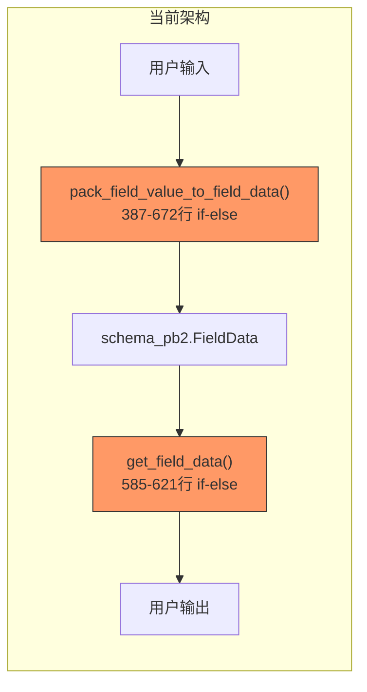
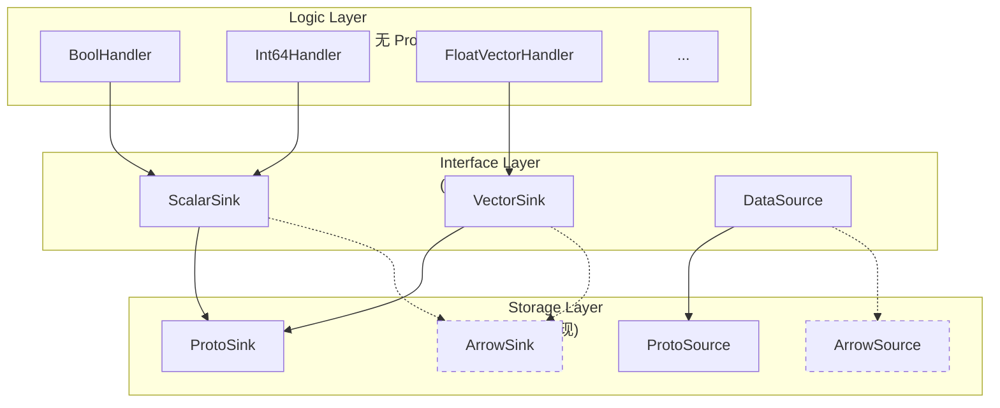
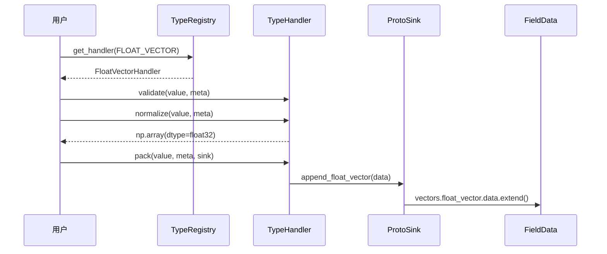
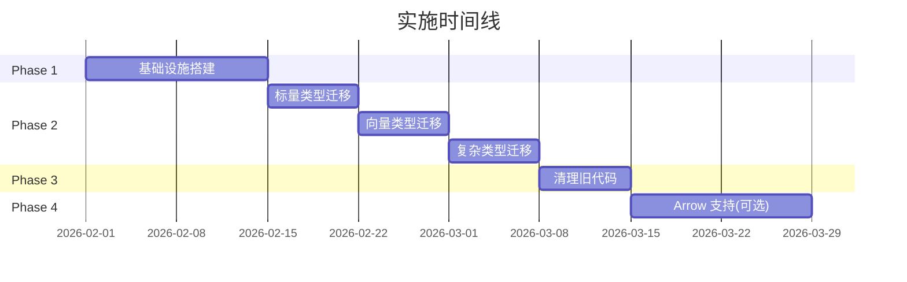

# TypeHandler 重构提案

## TL;DR

**问题**：PyMilvus 的类型处理逻辑分散在 5+ 个核心文件中，以 500+ 行的 if-else 链形式存在，与 ProtoBuf 紧耦合，难以测试、维护和扩展。

**方案**：引入多态 TypeHandler 系统，将 22 种数据类型的处理逻辑抽象为独立的 Handler 类，通过 Sink/Source 接口与存储层解耦。

**收益**：
- 添加新类型：5+ 文件 → 1 个 Handler 文件
- 支持新协议（如 Arrow）：无需修改业务逻辑
- 测试覆盖：可独立测试每个 Handler

**风险**：低，采用渐进式迁移 + Feature Flag

---

## 目录

1. [问题分析](#1-问题分析)
2. [架构设计](#2-架构设计)
3. [核心接口](#3-核心接口)
4. [类型覆盖矩阵](#4-类型覆盖矩阵)
5. [实施计划](#5-实施计划)
6. [非目标](#6-非目标)
7. [开放问题](#7-开放问题)
8. [附录](#8-附录)

---

## 1. 问题分析

### 1.1 现状

类型处理逻辑分散在以下核心文件中：

| 文件 | 代码行数 | 类型分支数 | 主要职责 |
|------|----------|------------|----------|
| [entity_helper.py](file:///Users/zilliz/pymilvus/pymilvus/client/entity_helper.py) | 1452 | 17+ | 写入路径（pack） |
| [search_result.py](file:///Users/zilliz/pymilvus/pymilvus/client/search_result.py) | 891 | 18+ | 读取路径（extract） |
| [prepare.py](file:///Users/zilliz/pymilvus/pymilvus/client/prepare.py) | 2658 | 分散 | 请求构造 |
| [bulk_writer/buffer.py](file:///Users/zilliz/pymilvus/pymilvus/bulk_writer/buffer.py) | 432 | 分散 | 批量写入 |

### 1.2 核心问题



**问题清单**：

1. **God Function**：`pack_field_value_to_field_data` 函数包含 17 个类型分支
2. **代码重复**：相同的 if-else 逻辑在 6 处重复出现
3. **协议锁定**：业务逻辑与 `schema_pb2` 紧密耦合
4. **维护成本高**：添加新类型需要修改 5+ 个文件
5. **测试困难**：无法单独测试类型逻辑

### 1.3 示例：添加新类型的当前流程

```
添加 TIMESTAMPTZ 类型需要修改：
├── entity_helper.py       # pack 逻辑
├── search_result.py       # extract 逻辑 x3 处
├── prepare.py             # 验证逻辑
├── bulk_writer/buffer.py  # 批量写入
└── types.py               # 类型定义
```

---

## 2. 架构设计

### 2.1 三层架构



### 2.2 数据流



---

## 3. 核心接口

### 3.1 TypeHandler（精简版）

```python
class TypeHandler(ABC):
    """类型处理器基类，每个 DataType 对应一个实现"""
    
    @property
    @abstractmethod
    def supported_types(self) -> tuple[DataType, ...]: ...
    
    @abstractmethod
    def validate(self, value: Any, meta: FieldMeta) -> None:
        """验证输入，失败抛出 ValidationError"""
    
    @abstractmethod
    def normalize(self, value: Any, meta: FieldMeta) -> Any:
        """标准化输入（如 list -> np.array）"""
    
    @abstractmethod
    def pack(self, value: Any, meta: FieldMeta, sink: DataSink) -> None:
        """写入数据到 Sink"""
    
    @abstractmethod
    def extract(self, source: DataSource, meta: FieldMeta, index: int) -> Any:
        """从 Source 读取数据"""
```

### 3.2 FieldMeta

```python
@dataclass(frozen=True)
class FieldMeta:
    """字段元数据 - 包含类型处理所需的完整上下文"""
    name: str
    dtype: DataType
    
    # 向量相关
    dim: Optional[int] = None
    
    # 字符串相关
    max_length: Optional[int] = None
    
    # 数组相关
    element_type: Optional[DataType] = None
    
    # Nullable 支持
    nullable: bool = False
    default_value: Optional[Any] = None
    
    # 特殊字段标记
    is_primary: bool = False
    is_partition_key: bool = False
    is_dynamic: bool = False           # JSON 动态字段
    is_function_output: bool = False   # 函数输出字段（不可插入）
    
    # 扩展参数
    params: Optional[Dict] = None
```

### 3.3 Sink/Source 接口

```python
# Sink：写入接口
class ScalarSink(Protocol):
    def append_bool(self, value: bool) -> None: ...
    def append_int(self, value: int) -> None: ...
    def append_string(self, value: str) -> None: ...
    # ...

class VectorSink(Protocol):
    def set_dim(self, dim: int) -> None: ...
    def append_float_vector(self, data: List[float]) -> None: ...
    # ...

# Source：读取接口
class ScalarSource(Protocol):
    def get_bool_data(self) -> List[bool]: ...
    def get_int_data(self) -> List[int]: ...
    # ...
```

### 3.4 TypeRegistry

```python
class TypeRegistry:
    """Handler 注册表（单例）"""
    
    def get_handler(self, dtype: DataType) -> TypeHandler: ...
    def register(self, dtype: DataType, handler: TypeHandler) -> None: ...

# 使用示例
handler = TypeRegistry().get_handler(DataType.FLOAT_VECTOR)
handler.validate(user_input, field_meta)
```

### 3.5 特殊数据处理场景

> [!WARNING]
> **以下场景需要特别注意，在 Handler 实现中必须正确处理**

#### 3.5.1 valid_data（Nullable 字段）

**问题**：Milvus 支持 nullable 字段，使用 `valid_data` 位图标记每个位置是否有效。对于向量字段，物理存储是稀疏的（只存有效数据）。

```python
# 当前代码模式 (entity_helper.py:1136-1150)
if len(field_data.valid_data) > 0 and field_data.valid_data[index] is False:
    row_data[field_name] = None
else:
    phys_idx = get_physical_index(field_data, index)  # 逻辑索引 -> 物理索引
    # 提取数据...
```

**设计方案**：
```python
class DataSource(Protocol):
    def get_valid_data(self) -> Optional[List[bool]]:
        """返回有效性位图，None 表示非 nullable 字段"""
    
    def get_physical_index(self, logical_index: int) -> int:
        """将逻辑索引转换为物理索引（处理稀疏存储）"""

class TypeHandler(ABC):
    def extract(self, source: DataSource, meta: FieldMeta, index: int) -> Any:
        # Handler 内部处理 nullable 逻辑
        if meta.nullable:
            valid = source.get_valid_data()
            if valid and not valid[index]:
                return None
            index = source.get_physical_index(index)
        # 继续提取...
```

#### 3.5.2 is_dynamic（动态字段）

**问题**：动态字段存储在特殊的 JSON 字段中，extract 时需要展开到 entity 顶层。

```python
# 当前代码模式 (search_result.py:224-234)
if not field_data.is_dynamic:
    item["entity"][field_name] = json_dict
else:
    if not dynamic_fields:
        item["entity"].update(json_dict)  # 展开到顶层
    else:
        item["entity"].update({k: v for k, v in json_dict.items() if k in dynamic_fields})
```

**设计方案**：
```python
class JSONHandler(TypeHandler):
    def extract(
        self, 
        source: DataSource, 
        meta: FieldMeta, 
        index: int,
        dynamic_fields: Optional[Set[str]] = None  # 额外参数
    ) -> Union[Dict, List[Tuple[str, Any]]]:
        json_dict = self._parse_json(source, index)
        
        if not meta.is_dynamic:
            return json_dict
        
        # 动态字段返回展开的键值对
        if not dynamic_fields:
            return list(json_dict.items())
        return [(k, v) for k, v in json_dict.items() if k in dynamic_fields]
```

#### 3.5.3 highlight（搜索高亮）

**设计边界**：Highlight 是搜索结果的 **附加元数据**，不属于字段类型处理范畴。

```python
# highlight 处理在 SearchResult 层，不在 TypeHandler 层
hit["highlight"] = {
    result.field_name: {
        "fragments": list(result.datas[i].fragments),
        "scores": list(result.datas[i].scores),
    }
    for result in highlight_results
}
```

**结论**：Highlight 保持在 `SearchResult` 层处理，不纳入 TypeHandler 重构范围。

#### 3.5.4 default_value（默认值）

**问题**：nullable 字段或 default 字段在 pack 时，缺失值需要正确处理。

**设计方案**：
```python
def pack_with_defaults(
    value: Any, 
    meta: FieldMeta, 
    sink: DataSink,
    handler: TypeHandler
) -> None:
    if value is None:
        if meta.nullable:
            sink.mark_null()
            return
        if meta.default_value is not None:
            value = meta.default_value
        else:
            raise ValidationError(meta.name, "non-null value", "None")
    
    handler.pack(handler.normalize(value, meta), meta, sink)
```

#### 3.5.5 稀疏向量物理索引

**问题**：向量字段的 nullable 采用稀疏存储，物理数据只包含有效值，需要索引映射。

**设计方案**：使用前缀和缓存实现 O(1) 索引转换：
```python
class ProtoVectorSource(VectorSource):
    def __init__(self, field_data):
        self._field_data = field_data
        self._prefix_sum = None  # 延迟计算
    
    def get_physical_index(self, logical_index: int) -> int:
        if not self._field_data.valid_data:
            return logical_index
        
        if self._prefix_sum is None:
            # 一次性计算前缀和
            self._prefix_sum = np.cumsum(
                [0] + [1 if v else 0 for v in self._field_data.valid_data]
            )
        return int(self._prefix_sum[logical_index])
```

---

## 4. 类型覆盖矩阵

| 类别 | DataType | Handler | 优先级 |
|------|----------|---------|--------|
| **标量** | BOOL, INT8/16/32, INT64, FLOAT, DOUBLE | ScalarHandler 系列 | P0 |
| **字符串** | VARCHAR, GEOMETRY, TIMESTAMPTZ | StringHandler 系列 | P0 |
| **向量** | FLOAT_VECTOR, BINARY_VECTOR | DenseVectorHandler 系列 | P0 |
| **特殊向量** | FLOAT16, BFLOAT16, INT8_VECTOR | BytesVectorHandler 系列 | P1 |
| **稀疏向量** | SPARSE_FLOAT_VECTOR | SparseVectorHandler | P1 |
| **复杂类型** | JSON, ARRAY | ComplexHandler 系列 | P1 |
| **内部类型** | STRUCT, _ARRAY_OF_VECTOR | InternalHandler 系列 | P2 |

> **共计 22 种类型，需要约 16 个 Handler 类**

---

## 5. 实施计划

### 5.1 阶段划分



### 5.2 迁移策略：双写模式

```python
# entity_helper.py 修改示例
def pack_field_value_to_field_data(..., use_handlers: bool = False):
    if use_handlers:
        # 新路径：使用 Handler
        handler = TypeRegistry().get_handler(field_data.type)
        handler.pack(value, meta, ProtoSink(field_data))
        return
    
    # 旧路径：保持现有逻辑
    # ... 现有 if-else 代码 ...
```

### 5.3 Feature Flag

```python
# 环境变量控制
PYMILVUS_USE_TYPE_HANDLERS=true  # 启用新路径

# Deprecation 路径
# v2.5.x：默认关闭，可通过环境变量启用
# v2.6.0：默认启用，可通过环境变量关闭
# v2.7.0：移除旧实现
```

---

## 6. 非目标

本次重构 **不包含**：

| 非目标 | 原因 |
|--------|------|
| 修改公开 API | 保持向后兼容 |
| 优化网络传输 | 属于 gRPC 层优化 |
| 实现 Arrow IPC 全链路 | 单独 RFC |
| 重构 ORM 层 | 范围过大 |
| 修改 Schema 定义 | 服务端改动 |

---

## 7. 开放问题

> [!IMPORTANT]
> **需要讨论的问题**

1. **STRUCT 类型处理**：当前实现较复杂（prepare.py 中 200+ 行），是否纳入 Phase 2？

2. **错误消息格式**：是否统一使用 `ExceptionsMessage` 模式？

3. **性能基准**：是否需要在迁移前后进行性能对比测试？

4. **Arrow 优先级**：Arrow IPC 返回路径是否需要更高优先级？

---

## 8. 附录

### 8.1 现有核心函数位置

| 函数 | 文件 | 行号 | 类型分支数 |
|------|------|------|------------|
| `pack_field_value_to_field_data` | entity_helper.py | 387-672 | 17 |
| `entity_to_field_data` | entity_helper.py | 676-765 | 14 |
| `extract_row_data_from_fields_data` | entity_helper.py | 1009-1200+ | 15 |
| `get_field_data` | search_result.py | 585-621 | 18 |
| `HybridHits.materialize` | search_result.py | 150-284 | 8 |
| `SearchResult._get_fields_by_range` | search_result.py | 403-572 | 12 |

### 8.2 Handler 实现示例

<details>
<summary>FloatVectorHandler 完整实现（点击展开）</summary>

```python
class FloatVectorHandler(TypeHandler):
    @property
    def supported_types(self):
        return (DataType.FLOAT_VECTOR,)
    
    def validate(self, value: Any, meta: FieldMeta) -> None:
        if value is None:
            if not meta.nullable:
                raise ValidationError(meta.name, "non-null", "None")
            return
        
        if isinstance(value, np.ndarray):
            if value.dtype not in (np.float32, np.float64):
                raise ValidationError(
                    meta.name, 
                    "float32/float64 array", 
                    str(value.dtype)
                )
            actual_dim = len(value)
        elif isinstance(value, (list, tuple)):
            actual_dim = len(value)
        else:
            raise ValidationError(meta.name, "list or np.ndarray", type(value).__name__)
        
        if meta.dim and actual_dim != meta.dim:
            raise DimensionMismatchError(meta.name, meta.dim, actual_dim)
    
    def normalize(self, value: Any, meta: FieldMeta) -> Optional[np.ndarray]:
        if value is None:
            return None
        if isinstance(value, np.ndarray):
            if value.dtype == np.float32:
                return value  # 零拷贝
            return value.astype(np.float32, copy=False)
        return np.array(value, dtype=np.float32)
    
    def pack(self, value: Any, meta: FieldMeta, sink: VectorSink) -> None:
        if value is None:
            sink.set_dim(meta.dim or 0)
            sink.mark_null()
            return
        sink.set_dim(len(value))
        sink.append_float_vector(value.tolist())
    
    def extract(self, source: VectorSource, meta: FieldMeta, index: int) -> Optional[List[float]]:
        valid_data = source.get_valid_data()
        if valid_data and not valid_data[index]:
            return None
        dim = source.get_dim()
        data = source.get_float_vector_data()
        start = index * dim
        return list(data[start:start + dim])
```

</details>

### 8.3 ProtoSink 实现示例

<details>
<summary>ProtoScalarSink 实现（点击展开）</summary>

```python
class ProtoScalarSink(ScalarSink):
    """Proto 标量数据 Sink 适配器"""
    
    def __init__(self, field_data: schema_types.FieldData):
        self._field_data = field_data
    
    def append_bool(self, value: bool) -> None:
        self._field_data.scalars.bool_data.data.append(value)
    
    def append_int(self, value: int) -> None:
        self._field_data.scalars.int_data.data.append(value)
    
    def append_long(self, value: int) -> None:
        self._field_data.scalars.long_data.data.append(value)
    
    def append_float(self, value: float) -> None:
        self._field_data.scalars.float_data.data.append(value)
    
    def append_double(self, value: float) -> None:
        self._field_data.scalars.double_data.data.append(value)
    
    def append_string(self, value: str) -> None:
        self._field_data.scalars.string_data.data.append(value)
    
    def append_json(self, value: bytes) -> None:
        self._field_data.scalars.json_data.data.append(value)
    
    def mark_null(self) -> None:
        self._field_data.valid_data.append(False)
```

</details>

### 8.4 目录结构

```
pymilvus/client/handlers/
├── __init__.py          # 公开 API
├── base.py              # TypeHandler, FieldMeta, Sink/Source 接口
├── registry.py          # TypeRegistry 单例
├── proto_sink.py        # ProtoScalarSink, ProtoVectorSink
├── proto_source.py      # ProtoScalarSource, ProtoVectorSource
├── scalar_handlers.py   # Bool, Int, Float, String handlers
├── vector_handlers.py   # 向量 handlers
└── complex_handlers.py  # JSON, Array handlers
```

---

## 修订历史

| 版本 | 日期 | 作者 | 变更 |
|------|------|------|------|
| 0.1 | 2026-01-23 | Deepmind-Agent | 初稿 |
| 0.2 | 2026-01-23 | Deepmind-Agent | 添加代码调研结果，补充完整接口设计 |
| 0.3 | 2026-01-23 | Deepmind-Agent | 优化文档结构，添加 Mermaid 图，精简代码示例 |
